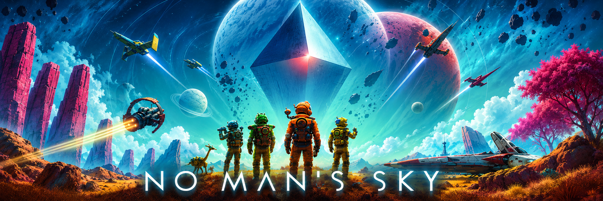

<p align="center">
  
</p>

<h1 align="center">NMS // TEXT CODES</h1>

**A complete, community-driven reference for No Man's Sky's in-game text formatting codes** — every color tag and every icon tag, documented, extracted, and packaged into a single self-contained interactive HTML guide.

<!-- BADGES CENTRES + LIENS HYPERTEXT INCLUS -->
<p align="center">
  <a href="https://creativecommons.org/licenses/by-nc-sa/4.0/">
    
  </a>
  <a href="https://github.com/Data-Spirit/NMS_TC">
    
  </a>
  <a href="https://github.com/Data-Spirit/NMS_TC">
    
  </a>
</p>

> ⚠️ **Unofficial, fan-made project.** Not affiliated with, endorsed by, or sponsored by Hello Games.

---

## What is this?

No Man's Sky lets players color and decorate names (bases, ships, freighters, storage containers, star systems...) using an undocumented in-game text-tag system. **NMS_TC** compiles every known tag into a single interactive guide:

- 🎨 **~60 color tags** — sorted as a visual spectrum, with sortable columns (name, hue, hex, luminosity) and one-click copy
- 🖼️ **145 icon tags** — individually extracted and cleaned from in-game screenshots, grouped by category
- ⚡ **A live simulator** — preview color + icon combinations, including the icon-tinting trick, before pasting them in-game
- 📦 **A reusable icon bank** — standalone transparent PNGs, free to reuse in other projects
- 🌐 **Fully self-contained** — a single HTML file per language, works fully offline, no installation required

---

## 📖 Guide by language

<details>
<summary>📋 Table Legend : </summary>

- 🛠️ **Info** — Detailed documentation and language-specific information about the guide.  
- 📖 **Guide** — Open the complete guide online through GitHub Pages.  
- 💾 **Download** — Download the standalone HTML guide for offline use.

**Status**
- ✅ **Available** — The resource is complete and available.
- 🚧 **Work in progress** — The resource is currently being developed or translated.
- 🔜 **Planned** — The resource is planned but work has not started yet.

</details>

| | Language | 🛠️ Info | 📖 Guide | 💾 Download |
|:---:|---|:---:|:---:|:---:|
| 🇬🇧 | **English** | 📝 [README_EN](./LANG/EN/README_EN.md) | [🌐 Guide : EN ↗️](https://data-spirit.github.io/NMS_TC/LANG/EN/NMS_txt_code_EN.html) | [](https://github.com/Data-Spirit/NMS_TC/releases/download/v1.0/NMS_txt_code_EN.html) |
| 🇫🇷 | **Français** | 📝 [README_FR](./LANG/FR/README_FR.md) | [🌐 Guide : FR ↗️](https://data-spirit.github.io/NMS_TC/LANG/FR/NMS_txt_code_FR.html) | [](https://github.com/Data-Spirit/NMS_TC/releases/download/v1.0/NMS_txt_code_FR.html) |
| 🇪🇸 | **Español** | 📝 [README_ES](./LANG/ES/README_ES.md) | [🌐 Guide : ES ↗️](https://data-spirit.github.io/NMS_TC/LANG/ES/NMS_txt_code_ES.html) | [](https://github.com/Data-Spirit/NMS_TC/releases/download/v1.0/NMS_txt_code_ES.html) |
| 🇩🇪 | **Deutsch** | 🔜 Planned | 🔜 Planned | 🔜 Planned |
| 🇮🇹 | **Italiano** | 🔜 Planned | 🔜 Planned | 🔜 Planned |

More languages may be added over time. Each language folder has its own detailed README describing that guide's features in full.

---

## 📁 Repository structure

```
NMS_TC/
├── assets/               → Graphic elements of NMS_TC
├── BANK_ICONS/           → Standalone icon assets (transparent PNGs)
├── docs/                 → Additional documentation
├── LANG/
│   ├── FR/               → French guide (HTML + detailed README)
│   └── EN/               → English guide (coming soon)
├── index.html            → Index file for GitHub Pages.
├── LICENSE.md
└── README.md             → this file
```

---

## License

Original content created by **Spirit** is licensed under [CC BY-NC-SA 4.0](https://creativecommons.org/licenses/by-nc-sa/4.0/). See [LICENSE.md](./LICENSE.md) for the full terms.

No Man's Sky and all related game assets, trademarks, and intellectual property remain the property of Hello Games and/or their respective rights holders.

This is an unofficial community-created resource and is not affiliated with or endorsed by Hello Games.
